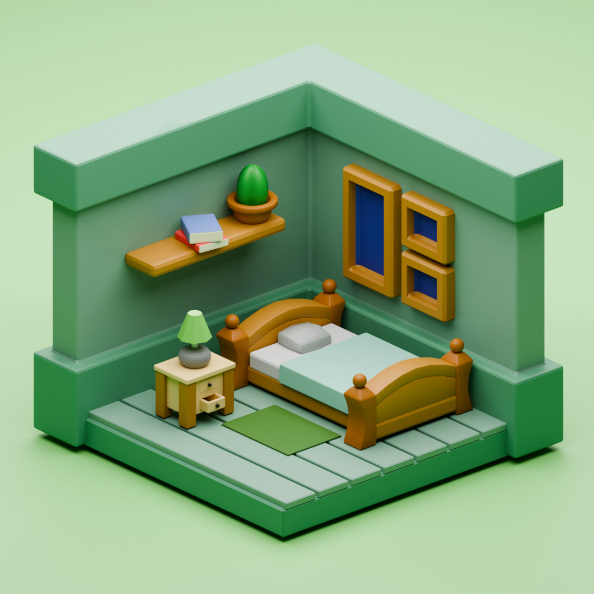

# GLSL Shaders for 3D Modeling

Welcome to my GitHub repository! This collection contains a variety of **GLSL fragment shaders** specifically designed for **3D modeling** and **rendering**. These shaders are aimed at enhancing the visual quality and complexity of 3D scenes, offering effects ranging from basic shading to advanced lighting and surface details. 

## 🖼️ What is demoscening

Demoscening is an art form and subculture focused on creating real-time audiovisual presentations known as "demos." These demos are created by programmers, graphic artists, and musicians, often pushing the limits of hardware and software to produce highly optimized, visually stunning effects. Demoscene productions showcase technical skill through the efficient use of shaders, procedural generation, and other advanced coding techniques. 

Shaders do not restrict to the display on an output screen, but they concern all the pipeline to represent 23 or 3D data on a monitor screen using a GPU. The **shader pipeline** is a sequence of programmable stages in the graphics rendering process, where different types of shaders are applied to transform and render 3D objects into pixels on the screen. This pipeline allows for real-time manipulation of geometry, lighting, textures, and effects. The typical steps in the shader pipeline include:

1. **Vertex Shader**: Processes each vertex's attributes (position, color, normals) and transforms them from 3D space to 2D screen space.
2. **Tessellation Shader (optional)**: Subdivides geometry into finer pieces for smoother curves or more detail.
3. **Geometry Shader (optional)**: Modifies, generates, or discards geometry (vertices or triangles) on the fly.
4. **Fragment (Pixel) Shader**: Determines the color of each pixel based on lighting, textures, and material properties.
5. **Rasterization**: Converts the processed geometry into pixels.
6. **Output Merger**: Combines pixel data, applies post-processing effects, and outputs the final image to the screen.

Each step allows fine control over the rendering process, enabling the creation of complex and realistic visual effects. Such shaders can be directly programmed for efficiency purpose, or created in 3D modelling software such as Blender. Here is an example of rendering I created on Blender by following a [tutorial on YouTube](https://www.youtube.com/watch?v=yCHT23A6aJA):

<br>
<p align="center">

</p>
<br>


## 🌟 Repository features

Here is the structure of the repository:

1. **Tutorial**: A 3D shader of a cylinder programmed step-by-step in 6 shaders using more and more advanced functions to get the final result;
2. **Fragment_shaders_collection**: My own collection of GLSL code with different basic effects (cellular noise, fractional Brownian motion, boolean operations, Ray Marching, texturing, lighting).

## 🔧 Requirements

To use these shaders, you'll need:

1. A **modern OpenGL** environment that supports GLSL;
2. A 3D rendering engine or application that allows for custom GLSL shader integration (e.g., **OpenGL**, **Unity**, **Unreal Engine**, or a custom engine).

 Alternatively, you can also directly copy/paste these shaders directly on the Internet using [Shadertoy](https://www.shadertoy.com/) to see the final result with **WebGL**.

## 🚀 Getting Started

1. **Clone the Repository**:
   ```bash
   git clone https://github.com/your-username/glsl-shaders-3d.git

## 📚 Additionnal links

If you want to learn more about OpenGL, fragment shaders and demoscening, here are some links:

- [Learn how to programm using OpenGL](https://learnopengl.com/)
- [Learn basic functions in fragment shaders programming](https://thebookofshaders.com/)
- [Inigo Quilez blog with its Signed Distance Functions database](https://iquilezles.org/articles/distfunctions/)
- [Introduction video to 2D fragment shaders](https://www.youtube.com/watch?v=f4s1h2YETNY)
- [Introduction video to Ray Marching for 3D fragment shaders](https://www.youtube.com/watch?v=khblXafu7iA)

